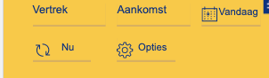
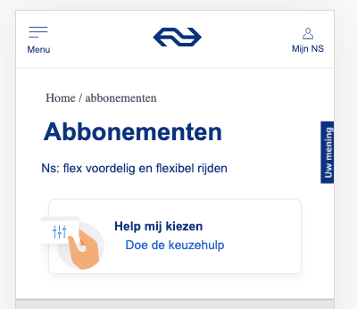
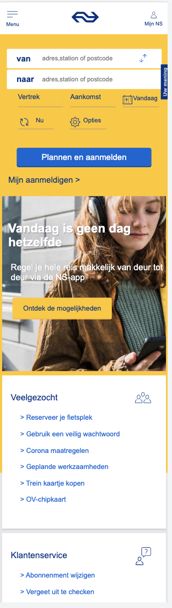
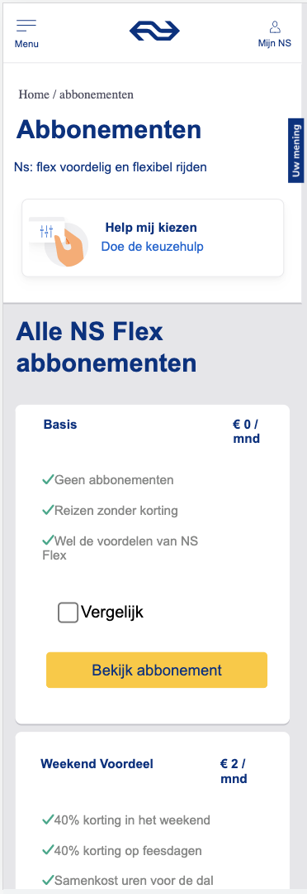
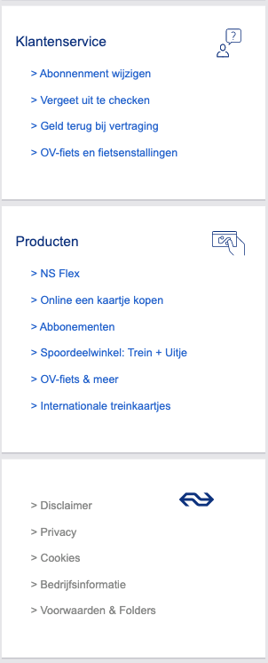
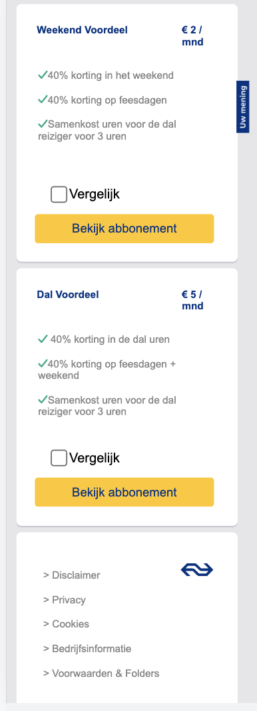

# Procesverslag
Markdown is een simpele manier om HTML te schrijven.  
Markdown cheat cheet: [Hulp bij het schrijven van Markdown](https://github.com/adam-p/markdown-here/wiki/Markdown-Cheatsheet).

Nb. De standaardstructuur en de spartaanse opmaak van de README.md zijn helemaal prima. Het gaat om de inhoud van je procesverslag. Besteedt de tijd voor pracht en praal aan je website.

Nb. Door *open* toe te voegen aan een *details* element kun je deze standaard open zetten. Fijn om dat steeds voor de relevante stuk(ken) te doen.

## Jij

ik weet nog eigenlijk niks van het vak en eerst ook niet wat het inhield. daarna heb ik gevraagd aan mijn mede studenten en zij zeiden dat het op internetstandaarden leek. Ik ben wel benieuwd naar wat ik allemaal ga leren alleen kijk er toch wel een beetje tegenop want ben niet zo goed in coderen.

### Auteur:
Sanne 't Hooft (vervangen door jouw naam)

#### Je startniveau:
De blauwe piste

#### Je focus:
Helemaal responsive maar weet dit nog niet zeker want weet nog niet zo goed want ze allebei inhouden
 

## Je website

Ik ben aan het zoeken om een makkelijke website te vinden om na te maken. Ik heb uiteindelijk de NS site gekozen omdat die er op het eerste oog niet erg moeilijk uitziet, en omdat ik niet super goed ben in coderen wil ik graag een makkelijke site :).

### Je opdracht:
Ik ga de website van de NS maken.

#### Screenshot(s) van de eerste pagina (small screen): 
https://www.ns.nl/ 

#### Screenshot(s) van de tweede pagina (small screen):
https://www.ns.nl/  

 

## Breakdownschets (week 1)

We hebben in de les de breakdownschets gemaakt en eerst dacht ik dat het onnodig werk was en dat ik alle HTML wil uit mijn hoofd wist en dat het zonde van mijn tijd was. Maar nadat ik de schets heb gemaakt zijn dingen voor mij veel duidelijker geworden en de schets heeft me geholpen om een begin te maken aan mijn HTML schrijven.

### de hele pagina: 

### dynamisch deel (bijv menu): 

### wellicht nog een dynamisch deel (bijv filter): 

## Voortgang 1 (week 2)

Ik heb veel huiswerkopdrachten gemaakt alleen veel zijn me ook niet gelukt maar door het in de les te bespreken zijn ze toch nog gelukt. Ik ben begonnen met mijn HTML van de basis van mijn CSS, en ga volgende week beginnen met de content van mijn site.
 
 Dit is een foto van mijn Humpty die totaal niet lukte waar ik ook veel stress kreeg van thuis. :)
 Gellukig kon ik in de les meedoen met de uitwerkingen en is hij zo mij toch wel gelukt.

 
 

### Stand van zaken
hier dit ging goed & dit was lastig (neem ook screenshots op van delen van je website en code)
Opzich alles wat ik tot nu toe hebt gemaakt was niet al te moeilijk, want heb alleen maar de basis van HTML en CSS gemaakt, straks als ik dieper in de stof ga en JS ga gebruiken gaat gebruiken gaan waarschijnlijk meer dingen fout :).

### Agenda voor meeting
samen met je groepje opstellen

| student 1 (ik)                     | student 2          | student 3    | student 4        |
| JS transformeren geleerd           | ---                | ---          | ---              |
| Iconen grootte maken                     | en dit             | en ik dit    | en dan ik dat    |
| Buttons echt laten werken          | dit als er tijd is | nog een punt | dit wil ik zeker |
| CSS schoner en leesbaarder maken    | ...                | ...          | ...              |

### Verslag van meeting
hier na afloop snel de uitkomsten van de meeting vastleggen

- Het eerste punt van wat ik heb meegenomen van de meeting was dat ik de opdracht niet goed snapte en de html moet kloppen en sommige buttons ook echt moeten werken en niet alleen maar een image zijn.
 
- Het tweeede punt is dat ik geleerd heb hoe ik de textje goed onder het icoontje te plaatsen zonder gebruik te maken van postition:fixed.
 
- Het derde punt van wat ik heb meegenomen is dat is mijn menu button ook echt moet laat transformeren als je erop klikt net zoals het in het echt zo is. Sanne had een hele codepen waar alle CSS en JS is staat om dat menu goed te laten tranformen wat toch wel heel erg handig is voor mij :).
 
- Ook heb ik meegenomen uit de meeting dat je alle lengtes in em moet zetten omdat je dan het goed mee kan schalen.

## Voortgang 2 (week 3)

Ik was druk bezig in de hele week ook met andere vakken dus heb alleen de laatste dag aan mijn website gewerkt. Hier merkte ik toch wel dat ik tegen wat meer problemen aanliep aangezien de code die ik nodig had wat moeilijker werd. Ik ben wel benieuwd om dit te vragen op vrijdag en dan de oplossingen te horen

### Stand van zaken
hier dit ging goed & dit was lastig (neem ook screenshots op van delen van je website en code)
 Wat dus fout ging op mijn website was dat ik 1 achtergrond foto niet goed in verhouding kreeg en ook niet lang genoeg. Ook had ik nog een vraag over hoe ik een stukje van mijn website moest doen en wat voor code ik daar voor nodig had

### Agenda voor meeting
samen met je groepje opstellen

Student 1 (ik):
 Wat voor code ik moest gebruiken voor een specifiek deel van mijn website en hoe ik een img meer height kon geven zonder dat de foto uit de verhouding ging.
 Student 2: Hoe je een header maakt en een hamburger menu en hoe je die 2 goed centreert.
 Student 3: Hoe je slideshows maakt met automatische transities.
 Student 4: wil meeluisteren met alles

### Verslag van meeting
hier na afloop snel de uitkomsten van de meeting vastleggen
 Deze week had ik een meeting met de student assistenten en die hebben mij ook goed geholpen met mijn vragen.

- Punt 1: Mijn vraag die ik had was hoe ik een img groter en kleiner moest maken en dat heb ik geleerd nu door hun.
- Punt 2: Ook hebben ze me geholpen om mijn HTML schoner te maken want ik wist niet dat als je een section gebruikt je ook verplicht bent om een h1 te gebruiken
- Punt 3: Ze hebben me geleerd om niet meer position fixed te gebruiken omdat dat soms onhandig is voor andere elementen eromheen.
- ...

## Toegankelijkheidstest (week 4)

 Vandaag gingen we de toegankelijkheid testen van onze website's die we gekozen hebben. Hierbij moesten we een aantaal verschillende testen doen, die de toegangkelijkheid van de website testten. De eerste test was dat je een machine op je arm kreeg en toen kreeg je het gevoel alsof je parkinson had en moest je zelf uitvogelen hoe je makkelijk door je eigen website kon navigeren. We hebben ook testen gedaan met screenreaders, sechtzienden en kleurenblinden.

### Bevindingen
Lijst met je bevindingen die in de test naar voren kwamen:
 De enige test waar ik echt moeite mee had was de parkinson test want daar was het echt heel moeilijk om iets te kunnen typen . De muis besturen was wel moeilijk maar als ik me goed focusde lukte het ook wel. Maar wat ik dus het geleerd hiervan is dat je goed moet kunnen tabben tussen alle buttons en ook een duidelijk focus state moet hebben zodat de gebruiker weet waar diegene is.

#### Parkinson Test

 De bevinding die ik uit deze test heb gehaald is dat ik elke img ook een button moet geven zodat iemand met bijv. parkinson makkelijk door de website kan tabben, omdat dat bijna het enige is wat hun kunnen doen om een website echt makkelijk en goed te kunnen gebruiken.

#### Kleurenblind & Slecht ziende test
 
 Met deze test merkte ik eigenlijk heel weinig verschil. Waarschijnlijk komt dat ook omdat ik natuurlijk niet echt kleurenblind of slechtziend ben maar alleen alsof doe met de brillen op. Ik merkte wel dat het iets moeilijker was om bepaalde focus en active states te zien omdat dat natuurlijk kleine verschillen zijn. Dus misschien een bevinding die ik hieruit kan halen is dat ik de active state en andere states extra duidelijk maak voor de gebruiker zodat ook slechtziende en kleurenblinden de verschillen tussen states kunnen zien 

#### Screen reader Test
 
 Deze test snapte ik eerst niet maar uiteindelijk bleek hij toch wel handig te zijn. Ik heb geleerd wat bijv. alt betekent dat achter een element staat want daar keek ik nooit van op. Maar nu weet ik dus dat ik die goed moet invullen zodat de screenreaders het duidelijk voor kunnen lezen, dus dat was mijn bevinding uit deze test.

## Voortgang 3 (week 4)

Ik heb na de toegangkelijkheids testen wel wat nog aan mijn site kunnen werken dus dat was toch wel erg fijn om die tijd te hebben. Helaas loop ik nog wel een beetje achter en moet ik deze week nog wel ff doorwerken aan mijn website.

### Stand van zaken
Waar ik vooral vastliep deze week is hoe ik een bepaald stukje van mijn site moest coderen, omdat die er toch wel heel erg moeilijk uitzag, maar gelukkih hebben we op vrijdag weer gesprekken waar ik dit soort dingen kan vragen. 

### Agenda voor meeting
samen met je groepje opstellen

Student 1 (ik):
 Ik vroeg me af wat voor HTML & CSS ik kon gebruiken bij een bepaald stukje voor mijn website. Ook gebruikt mijn site een soort van lichte schaduw over een van de img heen en ik ben benieuwd hoe ik dat kan namaken.
 
 Student 2:

### Verslag van meeting
hier na afloop snel de uitkomsten van de meeting vastleggen

- Ik heb geleerd hoe ik een gloed maak over een foto, alleen helaas ging ik dit proberen en had ik niet de juiste vraag gesteld :(.
- Ook heb ik geleerd hoe je een background img gebruikt en hoe je die in een button doet want ik wist eerst niet hoe ik dit zou moeten doen.
- Ik heb geleerd hoe ik Grid ik de praktijd kan toepassen en hoe ik dit voor mijn NS site gebruik.
- ...

 
## Eindgesprek (week 5)

Helaas heb ik mijn site niet helemaal afgekregen omdat ik erg veel tijd heb verloren aan kleine dingen die niet lukten en daar bleef ik dan ook in hangen helaas. De vormgeving is wel al best prima gelukt alleen de responsivesness en de surface plane heb ik nog niet helemaal goed gemaakt.Maar voor mezelf ben ik best wel blij met het resultaat omdat ik toch wel veel geleerd heb ik het process en ik voor dit vak me niet kon voorstellen dat ik ook maar in de buurt kon komen om een replica te maken van de NS site.

### Stand van zaken
Bijv. een van de stukjes waar ik uren lang mee aan het kloten was het stukje wat je ziet van de foto hiernaast.Ik kreeg ze niet goed naastelkaar en onderelkaar en ook de schaduw werkte de hele tijd niet mee. 
 
 Waar ik wel dan blij mee ben is de vormgeving van de mijn 2de pagina, eerst wist ik niet waar ik moest beginnen maar toen ik eraan begon ging het best prima en lijkt het ook nog is best wel erg op de pagina van de NS.  

### Screenshot(s)
                       
                       
 
 

 

## Bronnenlijst

Ik heb super veel gebruik gemaakt van al deze bronnen, ze zijn heel erg buhulpzaam geweest en ik weet wel zeker dat als ik niks kon opzoeken dat ik een hele magere website had.

Nb. Wees specifiek ('css-tricks' als bron is bijv. niet specifiek genoeg).

1. https://codepen.io/shooft/pen/KKqYPpr
2. https://codepen.io/fabianlaforga21/pen/OJgGPdj?editors=1100
3. https://extract.pics/
4. https://www.generacodice.com/en/articolo/289291/What-is-the-difference-between-:focus-and-:active
5. https://css-tricks.com/snippets/css/a-guide-to-flexbox/
6. https://www.w3schools.com/cssref/pr_background-position.asp
7. https://www.w3schools.com/cssref/pr_background-image.asp
8. https://codepen.io/fabianlaforga21/pen/YzQEZKZ
9. https://www.w3schools.com/cssref/pr_pos_z-index.asp
10. https://www.codegrepper.com/search.php?q=li%20without%20bullet
11. https://stackoverflow.com/questions/4137255/checkboxes-in-web-pages-how-to-make-them-bigger
12. https://developer.mozilla.org/en-US/docs/Web/CSS/:not
 En nog veel meer linkjes maar dit zijn wel bijna alle sites waar ik de informatie uit heb en kan de andere niet meer vinden :)

